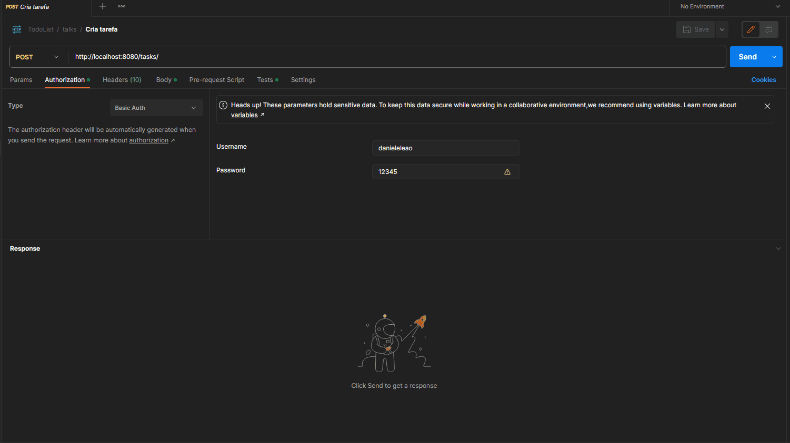

<h1>
    
</h1>
<h1>
    
</h1>
<h1>
    
</h1>

## :information_source: desafio
* Usuário
  * Cadastrar
  * Atualizar
  * Excluir
  * Listar
* Tarefas
  * Cadastrar
  * Atualizar
  * Excluir
  * Listar

Considere o cadastro com dados básicos:
* Usuário
  * (UUID) id 
  * (String) username 
  * (String) name
  * (String) password
  * (LocalDateTime) createdAt
* Tarefas
  * (UUID) id
  * (String) description
  * (String) title
  * (LocalDateTime) startAt
  * (LocalDateTime) endAt
  * (String) priority
  * (UUID) idUser - id do usuário
  * (LocalDateTime) createdAt 

## :information_source: json

* Usuário
```json
{
  "id": "fbdbb0de-34ee-4c29-82c3-a4f1735628c5",
  "username": "danieleleao",
  "name": "Daniele Leão",
  "password": "$2a$12$0abuZZDSYEqwKRC7DlxfU.56GDfY.PNaZ11bA0.70e2BLD2RJAhnK",
  "createdAt": "2023-10-14T01:26:49.1150181"
}
```

* Tarefas
```json
{
"id": "e1dbec7f-e193-4646-b651-3ce513bd8d15",
"description": "Tarefa para gravar aula de Tasks do Curso de Spring Boot",
"title": "Gravação de aula",
"startAt": "2023-10-06T12:30:00",
"endAt": "2023-10-06T15:35:00",
"priority": "ALTA",
"idUser": "fbdbb0de-34ee-4c29-82c3-a4f1735628c5",
"createdAt": "2023-10-14T01:27:22.542507"
}
```


## :seedling: Uso
Usuário pré cadastrado
```info
usuário = admin
senha = admin
```

## Técnologias usadas:

## Back-end:

* java version 17
* Maven
* H2
* rest client postman

## :iphone: Telas

Cadastro/Atualizar/Listar/Excluir usuário
<br />

<br /><br />
Cadastro/Atualizar/Listar/Excluir tarefa
<br />

<br /><br />
Excluir usuario x tarefa
<br />

